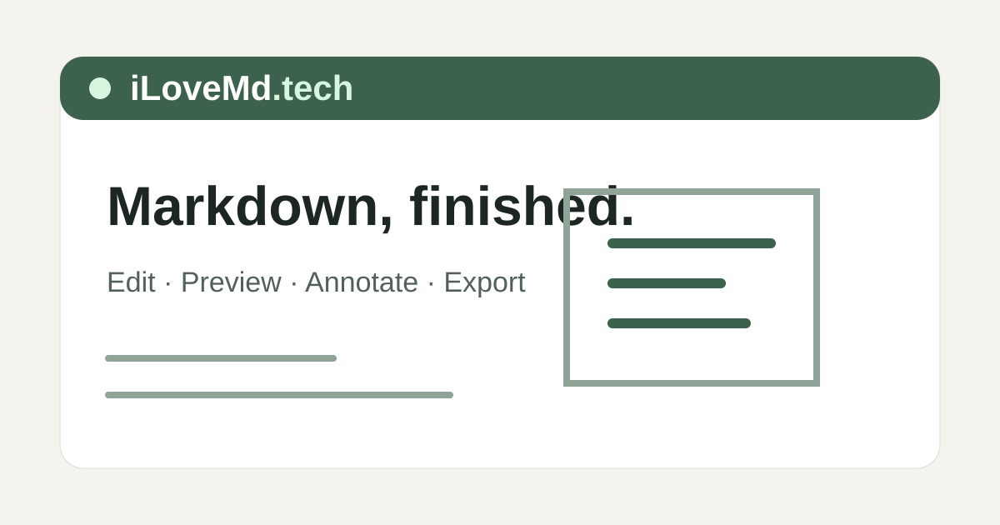

# iLoveMd

> A focused Markdown workspace for writing, previewing, annotating, and exporting polished documents.

[Open iLoveMd](https://ilovemd.tech/) · [Syntax guide](docs/syntax.md) · [Deployment guide](docs/deployment.md) · [Roadmap](docs/roadmap.md)



iLoveMd keeps Markdown as the source of truth while providing a document-oriented preview and export workflow. Write in a CodeMirror editor, inspect the rendered result beside it, add visual annotations, and produce shareable PDF, PNG, standalone HTML, Markdown, or source-and-asset bundle outputs.

It is useful for technical writers, students, researchers, developers, and anyone who wants more control over a Markdown document before sharing it. The browser workspace does not require an account, database, API key, or AI service.

> [!IMPORTANT]
> iLoveMd is a working project, not a certified production release. Browser storage is not a durable backup, public self-hosting needs additional operational controls, and PDF/UA conformance is not claimed. See [Project status](#project-status) for the current boundaries.

## Table of contents

- [Why iLoveMd](#why-ilovemd)
- [Features](#features)
- [Quick start](#quick-start)
- [Using the workspace](#using-the-workspace)
- [Data, privacy, and external services](#data-privacy-and-external-services)
- [Development](#development)
- [Deployment](#deployment)
- [Project status](#project-status)
- [Contributing](#contributing)
- [License](#license)
- [Acknowledgments](#acknowledgments)
- [Security](SECURITY.md)

## Why iLoveMd

Markdown is easy to author, but preparing a document for review or distribution often requires several disconnected tools. iLoveMd brings the important parts of that workflow into one workspace:

- **Keep the source portable.** Rendering does not rewrite the original Markdown.
- **See edits in context.** Use editor, split, or preview mode, with an outline and optional synchronized scrolling.
- **Review visually.** Draw, highlight, underline, add shapes and arrows, and preserve annotations with the document revision they belong to.
- **Export what you inspected.** PDF preview displays the actual generated PDF bytes before download. Export runs in the browser with the same parsing and document styles as the preview.
- **Work without a hosted account.** Drafts, local images, preferences, revision history, annotations, and exports stay in the browser.

## Features

### Authoring and preview

- CodeMirror Markdown editor with undo/redo, search and replace, keyboard commands, and a command palette
- Editor, split, and preview views with a keyboard-accessible resizable divider
- Source-to-preview synchronized scrolling and outline navigation
- Separate interface, document, and export themes, plus typography, width, and zoom controls
- Markdown import, image paste/upload, HTML-to-Markdown conversion, starter templates, and local revision history
- CommonMark 0.31.2 plus GFM tables, task lists, strikethrough, autolinks, and footnotes
- KaTeX mathematics with `mhchem`, Shiki syntax highlighting, Mermaid diagrams, and documented callout, column, figure, video, page-break, and table-of-contents directives
- Safe handling of imported table cells that represent line breaks as literal `\n`, without changing the saved source

For exact syntax, policies, and known limitations, read the [supported syntax guide](docs/syntax.md).

### Annotations and export

- Freehand pen, marker, highlighter, underline, line, arrow, rectangle, circle, selection, move, erase, undo, and redo tools
- Revision-aware annotation recovery and downloadable annotation backups
- PDF, PNG, and standalone HTML generation directly in the browser
- Direct browser downloads for Markdown and `.folio.zip` bundles containing source, settings, and referenced local images
- Export preflight diagnostics for missing assets, rendering problems, and printable bounds
- Configurable PDF paper, orientation, margins, theme, and background; PNG page, full-document, or selected-block output

Raw HTML is escaped and shown with a warning; arbitrary executable Markdown, MDX, custom HTML/CSS/SVG, and full LaTeX documents are not supported. Cloud accounts, synchronization, and live collaboration are also outside the current release.

## Quick start

### Prerequisites

- [Node.js 22](https://nodejs.org/) (the repository's `.node-version` is `22`)
- npm
- A modern browser with Canvas, SVG, and Web Worker support

No database or application credentials are required for local use.

### Install and run

```powershell
git clone https://github.com/razibit/ilovemd.git
cd ilovemd
npm ci
npx playwright install chromium
npm run build
npm start
```

Open <http://127.0.0.1:4174>. The production build checks the same static assets deployed to Cloudflare Workers.

For active development:

```powershell
npm run dev
```

Open <http://127.0.0.1:5173>. Vite serves the frontend; export does not require a second local process.

## Using the workspace

1. **Start with content.** Edit the sample, choose a template, import a `.md` or compatible `.folio.zip` file, or paste Markdown into the editor. Drop or paste an image to add it with alternative text and an optional caption.
2. **Review the result.** Switch among editor, split, and preview modes. Use the outline for navigation and enable **Sync scroll** when comparing source with rendered output.
3. **Adjust presentation.** Change document width, typography, theme, and zoom without rewriting the Markdown. Export appearance is configured separately and defaults to a light theme.
4. **Annotate when needed.** Enable the annotation layer in preview mode and add marks to the current rendered revision. If the document layout changes, iLoveMd preserves the earlier annotations for review instead of silently moving them.
5. **Export or back up.** Generate an export, review diagnostics, and inspect the PDF preview when applicable. Download Markdown or a `.folio.zip` bundle regularly for a durable copy of source and local assets.

Useful shortcuts include `Ctrl/Cmd+K` for the command palette and `Ctrl/Cmd+S` to download the unchanged Markdown source.

### Configuration

The server reads configuration from process environment variables; it does not automatically load a root `.env` file. The available examples are documented in [.env.example](.env.example):

| Variable | Purpose |
| --- | --- |
| `HOST` | Export service bind address; defaults to `127.0.0.1` |
| `PORT` | Export service port; defaults to `4174` |
| `FOLIO_ORIGINS` | Comma-separated allowed browser origins |
| `FOLIO_ACCESS_TOKEN` | Required export API token for non-loopback hosting |

Vite reads build-time options from `apps/web/.env.local`. `VITE_PORTFOLIO_URL` enables the optional owner portfolio link. Analytics is disabled by default; operators considering `VITE_ANALYTICS_MODE` should first read [analytics, privacy, SEO, and reporting](docs/analytics-seo.md).

## Data, privacy, and external services

- Markdown, local images, preferences, history, and annotations are stored in IndexedDB in the current browser profile.
- Local history retains up to 50 revisions. Conflicting tabs preserve a recovery copy instead of overwriting the current head.
- Browser storage may be cleared, evicted, or lost. It is not cloud sync or a permanent backup.
- Markdown and bundle exports are created in the browser.
- PDF, PNG, and standalone HTML exports are created in the current browser tab. The document and referenced assets are not sent to an export service.
- Remote images must first be explicitly stored by the browser or uploaded so exports remain self-contained.
- Analytics is disabled in local development and automated tests by default. The repository supports a restricted GTM/GA4 integration, but deployments are responsible for enabling it appropriately and meeting any consent requirements.

The deployed site's full notice is available at [ilovemd.tech/privacy](https://ilovemd.tech/privacy/). Self-hosters should review and adapt their own privacy disclosures and controls.

## Development

iLoveMd is an npm workspace written in TypeScript:

| Path | Responsibility |
| --- | --- |
| `apps/web` | React and CodeMirror workspace, browser rendering, IndexedDB storage, annotations, and PDF.js preview |
| `apps/export` | Optional legacy/reference renderer used for artifact comparison tests |
| `packages/engine` | Shared Markdown parser, source mapping, directives, math, highlighting, and diagnostics |
| `packages/themes` | Shared browser and print document styles |
| `tests` | Parser, annotation, export, browser, accessibility, and regression coverage |
| `docs` | Architecture, syntax, deployment, validation evidence, support boundaries, and roadmap |

### Available commands

| Command | Purpose |
| --- | --- |
| `npm run dev` | Run the Vite frontend with browser-side export |
| `npm run build` | Build the web application into `apps/web/dist` |
| `npm start` | Serve the built app and export API on port `4174` by default |
| `npm run typecheck` | Run the TypeScript compiler without emitting files |
| `npm test` | Run engine, export, and annotation integration tests |
| `npm run test:e2e` | Run the Chromium Playwright suite |
| `npm run licenses` | Regenerate third-party dependency notices |

The PDF integration tests additionally require the Poppler commands `pdftotext`, `pdfinfo`, and `pdffonts` on `PATH`. Run the checks in this order because `npm test` creates `output/pdf/document.png`, which a later browser test imports:

```powershell
npm run typecheck
npm run build
npm test
npm run test:e2e
npm audit
npm run licenses
```

For interactive browser debugging, use `npx playwright test --debug`; for a headed run without pausing, use `npx playwright test --headed`. Reports and traces are written to `output/playwright`, and PDF evidence is written to `output/pdf`.

When changing browser export, diagram rendering, or shared document styles, rebuild before testing exports.

See [architecture and decisions](docs/architecture.md) for the rendering and storage design, and [validation](docs/validation.md) for the repository's recorded test evidence and its limits.

## Deployment

`wrangler.json` configures `apps/web/dist` as static Cloudflare Worker assets at `ilovemd.tech`. PDF, PNG, HTML, Markdown, and bundle export all execute in the visitor's browser; production needs no export origin, container, Browser Rendering binding, access token, or paid third-party service. The Dockerfile is retained only as a reference for the legacy renderer.

Follow the [deployment and export boundaries guide](docs/deployment.md) before publishing the Worker assets.

## Project status

The application, local development workflow, shared preview/export renderer, and automated test suites are implemented. The [support matrix](docs/support-matrix.json) and [validation record](docs/validation.md) document what has been exercised.

Important current limitations include:

- Browser-generated PDF pages are rasterized, so PDF tagging, selectable text, and PDF/UA conformance are not claimed.
- Source/preview mapping has known limits around complex nested or unusually tall layouts.
- Bundled fonts cover Latin, Bengali, and Arabic; other scripts depend on system fallback and need broader testing.
- Browser storage quota exhaustion, asset garbage collection, and durable backup reminders need more work.

Confirmed future work is tracked in the [release roadmap](docs/roadmap.md). It separates production-validation work from compatibility ideas such as richer cross-references, additional export adapters, broader multilingual coverage, and offline document management. Roadmap items are plans, not available features or commitments.

## Contributing

Contributions are welcome from experienced maintainers and first-time open-source contributors alike. Useful contributions include code, bug reports, documentation, design feedback, accessibility improvements, testing, and translations.

See [CONTRIBUTING.md](CONTRIBUTING.md) for the contributor workflow, [CODE_OF_CONDUCT.md](CODE_OF_CONDUCT.md) for community standards, and [SECURITY.md](SECURITY.md) for private vulnerability reporting. Use the [bug report](.github/ISSUE_TEMPLATE/bug_report.yml) or [feature request](.github/ISSUE_TEMPLATE/feature_request.yml) form when opening a new issue.

1. Search the [existing issues](https://github.com/razibit/ilovemd/issues) before starting substantial work. Open an issue for a bug or proposal when discussion would help establish scope.
2. Fork the repository, clone your fork, and follow the [Quick start](#quick-start).
3. Keep each change focused. Preserve authored Markdown and existing storage/export compatibility unless the issue explicitly calls for a change.
4. Add or update tests for behavior changes. For visual or export work, inspect the rendered browser result and generated artifacts, not only the source code.
5. Run the relevant checks from [Development](#development), including the full sequence when your environment has the required browser and Poppler dependencies.
6. Submit a [pull request](https://github.com/razibit/ilovemd/pulls) explaining the problem, approach, validation performed, and any remaining limitations.

When reporting a bug, include the browser and operating system, reproduction steps, expected and actual behavior, relevant diagnostics, and a minimal Markdown sample with private information removed. Please do not post vulnerabilities or sensitive documents in a public issue; use the private route documented in [SECURITY.md](SECURITY.md).

## License

This project is licensed under the [MIT License](LICENSE).

You may use, copy, modify, merge, publish, distribute, sublicense, and sell copies of the project under the license terms, including the required copyright and permission notice. The software is provided “as is”, without warranty. Dependency licenses are separate and are recorded in [Third-Party Notices](docs/THIRD_PARTY_NOTICES.md).

## Acknowledgments

iLoveMd is built with open-source projects including React, CodeMirror, unified/remark/rehype, KaTeX, Shiki, Mermaid, Fastify, Playwright, PDF.js, and Sharp. See [Third-Party Notices](docs/THIRD_PARTY_NOTICES.md) and [dependency metadata](docs/dependencies.json) for the complete generated inventory and license information.
